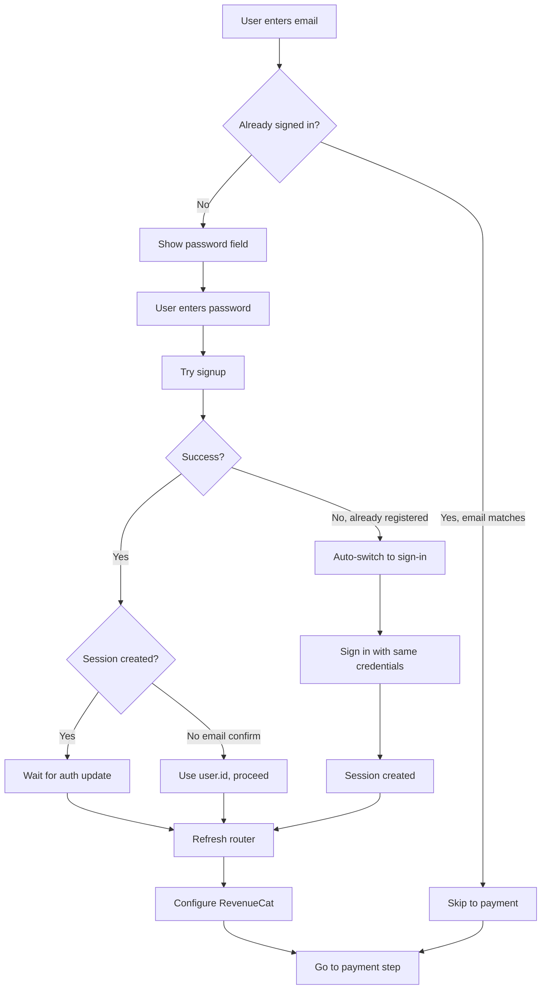

# Fix Subscribe Authentication Flow

## Problems

1. **Signup doesn't create session**: After signup, user is not signed in and doesn't see their profile in navbar. Supabase should know about the session.

2. **Duplicate signup prevention**: If user tries to subscribe again with an email that already has an account, it should detect this and either:
   - Skip to payment if already signed in
   - Show sign-in form if account exists but not signed in
   - Prevent duplicate signup attempts

## Solution

### Issue 1: Session Creation After Signup

**Root Cause**: After `signUp()`, if email confirmation is disabled, `data.session` should exist but we're not checking for it. Also, we need to wait for auth state to update via `onAuthStateChange`.

**Fix**:
- Check if `data.session` exists after signup
- If session exists, wait for auth provider to update (via `onAuthStateChange`)
- Refresh router to update navbar/profile display
- If no session (email confirmation required), handle gracefully but still allow proceeding with `data.user.id`

### Issue 2: Duplicate Signup Detection

**Root Cause**: We only detect duplicate signup after the user enters password and tries to sign up. We should check earlier.

**Fix**:
- When user enters email and clicks Continue, check if they're already signed in
- If signed in with matching email, skip directly to payment step
- If not signed in, show password field
- When password is entered, try signup first
- If signup fails with "already registered", automatically switch to sign-in mode
- After successful sign-in, proceed to payment

## Changes

### File: `app/subscribe/SubscribePageContent.tsx`

1. **Add email check on Continue click** (around line 186-205):
   - Check if user is already signed in with the entered email
   - If yes and email matches, skip to payment step immediately
   - If no, proceed to show password field

2. **Fix session handling after signup** (around line 245-256):
   - Check for `data.session` after signup
   - If session exists, wait for auth state to update (small delay or use auth provider callback)
   - Refresh the page or router to update navbar
   - Ensure `user` from `useAuth()` is updated

3. **Improve duplicate detection** (around line 235-243):
   - When signup fails with "already registered", automatically try sign-in
   - Don't require user to re-enter password if we just detected the account exists

4. **Add router refresh after auth** (after line 255 and 277):
   - Call `router.refresh()` to update server components
   - This ensures navbar/profile updates immediately

## Flow Diagram



## Implementation Details

### 1. Email Check on Continue

```typescript
// In handleAuthSubmit, before showing password field
if (!showPasswordField) {
    // Check if user is already signed in with this email
    if (user && user.email === email.trim()) {
        // Already signed in, skip to payment
        setCurrentStep("payment");
        return;
    }
    // Not signed in, show password field
    setShowPasswordField(true);
    return;
}
```

### 2. Session Handling After Signup

```typescript
if (data.user) {
    // Check if session was created
    if (data.session) {
        // Session exists, wait for auth provider to update
        // The onAuthStateChange in AuthProvider will update user state
        // Small delay to ensure state propagates
        await new Promise(resolve => setTimeout(resolve, 500));
        router.refresh(); // Refresh to update navbar/profile
    }
    
    setTempUserId(data.user.id);
    await loginUser(data.user.id);
    setCurrentStep("payment");
}
```

### 3. Auto Sign-In on Duplicate

```typescript
if (error.message.includes("already registered") || error.status === 400) {
    // User exists, try to sign in automatically
    const { data: signInData, error: signInError } = await supabase.auth.signInWithPassword({
        email,
        password,
    });
    
    if (signInError) {
        setAuthMode("signin");
        setPasswordError("User already exists. Please enter your password to sign in.");
        setIsAuthLoading(false);
        return;
    }
    
    // Sign-in successful
    if (signInData.user) {
        setTempUserId(signInData.user.id);
        await loginUser(signInData.user.id);
        router.refresh();
        setCurrentStep("payment");
    }
    return;
}
```

## Testing Checklist

- [ ] New user signup creates session and shows profile in navbar
- [ ] Already signed-in user with matching email skips to payment
- [ ] User with existing account is auto-switched to sign-in mode
- [ ] After signup/signin, navbar shows user profile
- [ ] Router refresh updates server components correctly
- [ ] RevenueCat is configured with correct user ID
- [ ] Payment step works after authentication

## Notes

- The auth provider's `onAuthStateChange` listener should automatically update user state
- Router refresh ensures server components (like navbar) see the new session
- Auto sign-in on duplicate detection improves UX by not requiring password re-entry