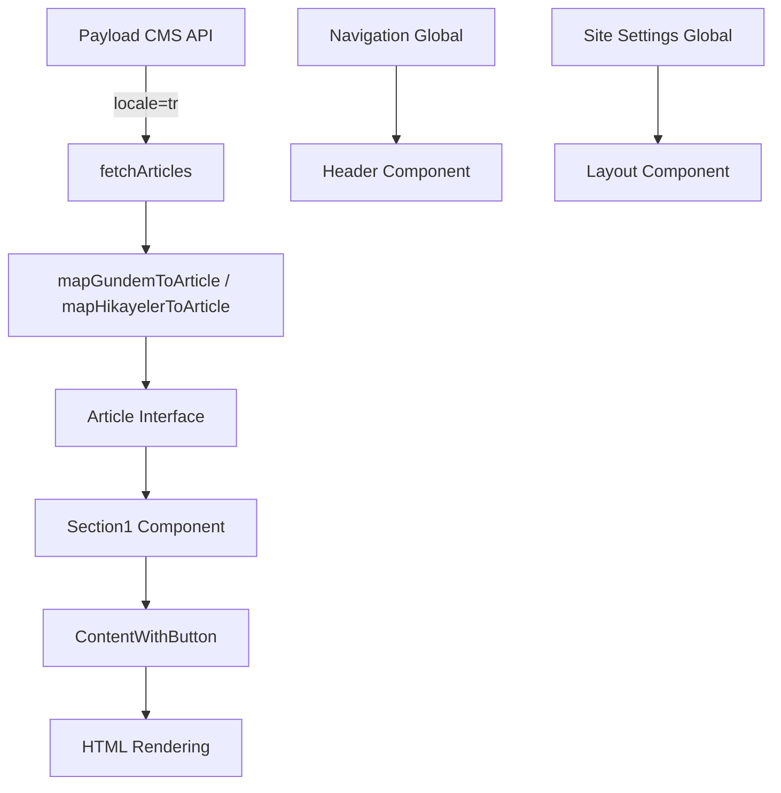

# Payload CMS Integration Improvements Plan

## Overview
Based on exploration of the Payload CMS admin panel at `https://cms.scrolli.co/admin`, this plan addresses improvements to better utilize the CMS structure and fix content display issues.

## Current State Analysis

### Payload CMS Structure Discovered

**Collections Hierarchy:**
- **Content Collections:**
  - `gundem` - Main news/articles (63+ items)
  - `hikayeler` - Stories (127+ items)
  - `podcasts` - Podcast content
  - `daily-briefings` - Daily briefing articles
  - `alaraai` - Alara AI articles
- **Configuration:**
  - `authors` - Author profiles (40+ authors)
  - `categories` - Content categories (4: Eksen, Zest, Finans, Gelecek)
  - `tags` - Content tags
- **Media:**
  - `media` - Media library
- **Globals:**
  - `site-settings` - Site configuration
  - `navigation` - Navigation menu structure
- **User Management:**
  - `users` - CMS users
  - `bookmarks` - User bookmarks
  - `analytics` - Analytics events
- **System:**
  - `api-keys` - API key management

### Gündem Collection Fields (from admin inspection)
- `title` (localized - Turkish)
- `titleFullScreen` (localized - Turkish)
- `subtitle` (localized - Turkish)
- `content` (HTML string when locale=tr)
- `summary` (localized - Turkish)
- `category` (relationship to Categories)
- `author` (relationship to Authors)
- `tags` (array of tag relationships)
- `featuredImage` (Media relationship)
- `mobileImage` (Media relationship)
- `thumbnail` (Media relationship)
- `thumbnailRSS` (Media relationship)
- `mainVideo` (string URL)
- `galleryImages` (array of Media)
- `relatedArticles` (polymorphic: gundem | hikayeler)
- `seoTitle`, `seoDescription`
- `readTime` (number)
- `isFeatured` (boolean)
- `ordering` (number)
- `layoutPosition` (enum: auto | hero | editors-picks | exclude)
- `publishedAt` (date)
- `createdAt`, `updatedAt` (timestamps)

### Hikayeler Collection Fields
- Similar to Gündem but:
  - No `category` field
  - Has `verticalImage` instead of `mobileImage`
  - Has `isCollab` (boolean)
  - Uses `relatedStories` instead of `relatedArticles`

## Issues Identified

1. **Content Display Issue**: Content is returned from API (verified 30KB+ HTML) but may not be rendering properly
2. **Missing Fields**: `subtitle` and `titleFullScreen` not in Article interface
3. **Navigation**: Currently using static `getCategoriesFromBlog()`, should use Payload Navigation global
4. **Site Settings**: Not being fetched or used
5. **Related Articles**: Relationship handling needs improvement
6. **Image Variants**: `mobileImage`, `thumbnailRSS`, `verticalImage` not handled
7. **Additional Collections**: Podcasts, Daily Briefings not integrated
8. **Error Handling**: Need better fallbacks for missing content

## Implementation Plan

### Phase 1: Fix Content Display (Priority 1)

**Files to Modify:**
- `lib/payload/types.ts` - Ensure content is properly mapped
- `components/sections/single/Section1.tsx` - Verify content rendering
- `components/sections/single/ContentWithButton.tsx` - Check content wrapper

**Changes:**
1. Verify content is being passed correctly through mapping functions
2. Ensure ContentWithButton properly handles HTML strings
3. Add debugging/logging to trace content flow
4. Test with actual article pages

**Expected Outcome:** Content displays correctly on article detail pages

---

### Phase 2: Enhance Article Interface (Priority 2)

**Files to Modify:**
- `types/content.ts` - Add missing fields
- `lib/payload/types.ts` - Update mapping functions
- `components/sections/single/Section1.tsx` - Display subtitle if available

**Changes:**
1. Add `subtitle?: string` to Article interface
2. Add `titleFullScreen?: string` to Article interface (for future use)
3. Update `mapGundemToArticle()` to include subtitle
4. Update `mapHikayelerToArticle()` to include subtitle
5. Display subtitle in article header if available

**Expected Outcome:** Subtitle field available and displayed when present

---

### Phase 3: Implement Navigation Global (Priority 3)

**Files to Modify:**
- `lib/payload/client.ts` - Fix getNavigation() implementation
- `components/layout/header/Header.tsx` - Use Payload navigation
- `lib/navigation.ts` - Update to use Payload API

**Changes:**
1. Verify Navigation global structure from Payload
2. Create TypeScript interface for Navigation global
3. Update Header component to fetch and use navigation data
4. Fallback to static categories if navigation fetch fails
5. Update MobileMenu to use navigation data

**Expected Outcome:** Navigation menu driven by Payload CMS

---

### Phase 4: Implement Site Settings Global (Priority 3)

**Files to Modify:**
- `lib/payload/client.ts` - Fix getSiteSettings() implementation
- Create `lib/site-settings.ts` - Site settings utilities
- `app/layout.tsx` - Fetch and use site settings

**Changes:**
1. Verify Site Settings global structure
2. Create TypeScript interface for Site Settings
3. Fetch site settings in root layout
4. Use settings for site title, description, logo, etc.
5. Add proper error handling

**Expected Outcome:** Site configuration driven by Payload CMS

---

### Phase 5: Improve Related Articles Handling (Priority 4)

**Files to Modify:**
- `lib/content.ts` - Improve getRelatedArticles()
- `lib/payload/types.ts` - Better relationship resolution
- `app/[slug]/page.tsx` - Enhanced related articles logic

**Changes:**
1. Properly resolve polymorphic relationships (gundem | hikayeler)
2. Handle both `relatedArticles` (Gündem) and `relatedStories` (Hikayeler)
3. Add fallback logic for articles without explicit relationships
4. Improve deduplication logic
5. Add category-based related articles as fallback

**Expected Outcome:** Better related articles suggestions

---

### Phase 6: Enhanced Image Handling (Priority 4)

**Files to Modify:**
- `lib/payload/types.ts` - Update getMediaUrl() helper
- `components/sections/single/Section1.tsx` - Use appropriate image variants
- `components/sections/home/HeroSection.tsx` - Use mobileImage for mobile

**Changes:**
1. Support `mobileImage` for responsive images
2. Support `thumbnailRSS` for RSS feeds
3. Support `verticalImage` for Hikayeler
4. Create responsive image component that selects appropriate variant
5. Update image mapping logic

**Expected Outcome:** Better image optimization and responsive display

---

### Phase 7: Additional Content Types (Priority 5)

**Files to Create/Modify:**
- `lib/payload/types.ts` - Add Podcast and DailyBriefing interfaces
- `lib/payload/client.ts` - Add fetch functions for new types
- `app/podcasts/page.tsx` - Podcast listing page (if needed)
- `app/daily-briefings/page.tsx` - Daily briefings page (if needed)

**Changes:**
1. Define TypeScript interfaces for Podcasts and Daily Briefings
2. Create fetch functions for these collections
3. Integrate into homepage if needed
4. Create dedicated pages if required

**Expected Outcome:** Support for all Payload content types

---

### Phase 8: Error Handling & Fallbacks (Priority 5)

**Files to Modify:**
- All Payload client functions
- All page components using Payload data
- `lib/content.ts` - Add comprehensive error handling

**Changes:**
1. Add try-catch blocks with meaningful error messages
2. Implement graceful degradation for missing content
3. Add fallback UI components
4. Log errors for debugging
5. Add retry logic for failed API calls

**Expected Outcome:** Robust error handling throughout

---

## Technical Details

### Content Flow Diagram

### Data Mapping

**Gündem → Article:**
- `title` → `title`
- `subtitle` → `subtitle` (NEW)
- `content` → `content` (HTML string)
- `summary` → `excerpt`
- `category.name` → `category`
- `author.name` → `author`
- `featuredImage.url` → `image`
- `publishedAt` → `date` (formatted)
- `readTime` → `readTime`
- `tags[0].tag.name` → `tag`

**Hikayeler → Article:**
- Similar mapping but:
- No category (defaults to "hikayeler")
- Uses `verticalImage` or `thumbnail` for image

### API Endpoints Used

- `GET /api/gundem?locale=tr&...` - Gündem articles
- `GET /api/hikayeler?locale=tr&...` - Hikayeler articles
- `GET /api/categories?locale=tr` - Categories
- `GET /api/authors?locale=tr` - Authors
- `GET /api/globals/navigation?locale=tr` - Navigation menu
- `GET /api/globals/site-settings?locale=tr` - Site settings

## Testing Checklist

- [ ] Content displays correctly on article pages
- [ ] Subtitle appears when available
- [ ] Navigation menu uses Payload data
- [ ] Site settings are applied
- [ ] Related articles work correctly
- [ ] Images use appropriate variants (mobile/desktop)
- [ ] Error handling works gracefully
- [ ] All content types are accessible

## Notes

- All API calls must include `locale=tr` parameter
- Content is returned as HTML strings (not RichText/Slate.js) when using locale=tr
- `layoutPosition` field exists but is currently disabled via feature flag
- Navigation and Site Settings globals may need structure verification
