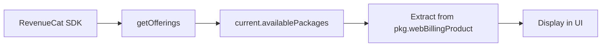
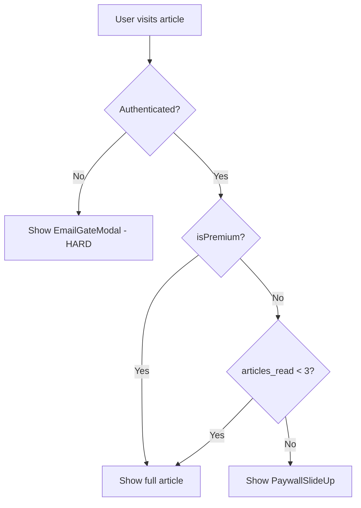

# Scrolli Subscription System - Implementation Plan

## Phase 1: Fix RevenueCat Pricing Display (Priority: Critical)

The current `/pricing` page shows "USD0" because price extraction is failing. We need to:

1. **Debug RevenueCat package structure** - Add console logging to see exact shape of `pkg.webBillingProduct`
2. **Fix price extraction in [`components/premium/RevenueCatPricing.tsx`](components/premium/RevenueCatPricing.tsx)** - Handle Web Billing price format correctly
3. **Connect PaywallSlideUp to RevenueCat** - Currently [`components/paywall/PaywallSlideUp.tsx`](components/paywall/PaywallSlideUp.tsx) has hardcoded prices (99/year, 9.99/month). Replace with dynamic RevenueCat offerings.



---

## Phase 2: Database Schema Enhancement

The current schema is missing fields for proper subscription tracking. Add a new migration:

**File: `supabase/migrations/007_subscription_tracking.sql`**

```sql
ALTER TABLE public.profiles
ADD COLUMN IF NOT EXISTS subscription_tier TEXT CHECK (subscription_tier IN ('monthly', 'yearly', 'lifetime', 'free')) DEFAULT 'free',
ADD COLUMN IF NOT EXISTS revenuecat_customer_id TEXT UNIQUE,
ADD COLUMN IF NOT EXISTS premium_since TIMESTAMPTZ,
ADD COLUMN IF NOT EXISTS current_period_start DATE DEFAULT CURRENT_DATE;

CREATE INDEX IF NOT EXISTS idx_revenuecat_customer_id ON public.profiles(revenuecat_customer_id);
```

Update TypeScript types in [`lib/supabase/types.ts`](lib/supabase/types.ts) to include these new fields.

---

## Phase 3: Enhanced Webhook Handler

Update [`supabase/functions/revenuecat-webhook/index.ts`](supabase/functions/revenuecat-webhook/index.ts):

1. **Map product IDs to tiers**:

   - `web_billing_monthly` → `monthly`
   - `web_billing_yearly` → `yearly`
   - `web_billing_lifetime` → `lifetime`

2. **Store additional metadata**: `subscription_tier`, `revenuecat_customer_id`, `premium_since`

3. **Handle all event types properly**:

   - `INITIAL_PURCHASE`, `RENEWAL` → `is_premium = true`
   - `NON_RENEWING_PURCHASE` (lifetime) → `is_premium = true`, `subscription_tier = 'lifetime'`
   - `EXPIRATION`, `REVOKE` → `is_premium = false`, `subscription_tier = 'free'`
   - `CANCELLATION` → Keep `is_premium = true` until expiration

---

## Phase 4: Hard Email Gate Implementation

The current [`EmailGateModal`](components/paywall/EmailGateModal.tsx) triggers at 30% scroll as a soft gate. For hard gate:

1. **Modify trigger behavior**: Show immediately for unauthenticated users (not on scroll)
2. **Block content completely**: Don't render article content until email submitted
3. **Update [`ArticleGateWrapper`](components/paywall/ArticleGateWrapper.tsx)**:



---

## Phase 5: Integrate PaywallSlideUp with RevenueCat

The current [`PaywallSlideUp`](components/paywall/PaywallSlideUp.tsx) has hardcoded TRY prices. Update to:

1. **Accept RevenueCat packages as props**
2. **Display dynamic prices** from `offerings.current.availablePackages`
3. **Handle purchase directly** via `purchasePackage()` instead of redirecting to `/subscribe`
4. **Add loading and error states**

---

## Phase 6: Monthly Reset Logic

Current implementation increments `articles_read_count` but doesn't reset monthly. Add:

1. **Lazy reset function** in [`ArticleGateWrapper`](components/paywall/ArticleGateWrapper.tsx):

   - Check if `last_reset_date` is before current month start
   - If so, reset `articles_read_count` to 0 and update `last_reset_date`

2. **Add SQL function** for server-side reset (optional, for scheduled jobs)

---

## Phase 7: Auth Callback Enhancement

Update [`app/auth/callback/route.ts`](app/auth/callback/route.ts) to:

1. **Mark first article as read** when user signs up via email gate
2. **Set `articles_read_count = 1`** for new signups from article gate
3. **Redirect back to original article** after auth

---

## File Changes Summary

| File | Action |

| --------------------------------------------------- | ------------------------------- |

| `supabase/migrations/007_subscription_tracking.sql` | CREATE |

| `lib/supabase/types.ts` | UPDATE - add new fields |

| `components/premium/RevenueCatPricing.tsx` | UPDATE - fix price extraction |

| `components/paywall/PaywallSlideUp.tsx` | UPDATE - RevenueCat integration |

| `components/paywall/EmailGateModal.tsx` | UPDATE - hard gate behavior |

| `components/paywall/ArticleGateWrapper.tsx` | UPDATE - monthly reset logic |

| `supabase/functions/revenuecat-webhook/index.ts` | UPDATE - enhanced handling |

| `app/auth/callback/route.ts` | UPDATE - first article tracking |

---

## Testing Checklist

1. Anonymous user visits article → Hard email gate appears immediately
2. User submits email → Magic link sent, redirected back after auth
3. Authenticated user reads articles → Counter increments (visible in navbar)
4. User hits 3 article limit → PaywallSlideUp appears with RevenueCat prices
5. User purchases subscription → Webhook updates `is_premium = true`
6. Premium user → All articles accessible, no gates
7. Monthly reset → Counter resets on first of month
